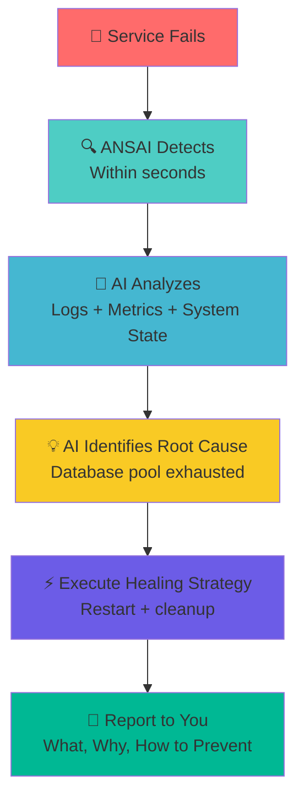

<div class="hero-section" markdown>

# Stop Scripting. Start Thinking.

**ANSAI = Ansible + AI**

**Your Flask app crashes at 3 AM.**

Traditional automation: *"Service restarted."*

**ANSAI:** *"Service failed due to database connection pool exhaustion (45/50 connections hung). Restarted service + closed stale connections. Fix: Add `pool_timeout=30` to database.py:47 to prevent future crashes."*

**That's the difference.** Not just automated—**intelligent.**

**Without AI, it's just Ansible. With ANSAI, it thinks.**

[Get Started →](#quick-start){ .md-button .md-button--primary .md-button--large }
[See How It Works →](#how-it-works){ .md-button .md-button--large }

</div>

---

## 🎯 Why AI-Powered Automation?

<div class="grid cards" markdown>

-   ### 🧠 **Intelligent, Not Just Automated**
    
    Traditional automation follows scripts. ANSAI uses AI to analyze, predict, and decide. **Your infrastructure actually thinks.**

-   ### 🔍 **Root Cause Analysis**
    
    Not just "service failed." ANSAI's AI analyzes logs, correlates events, identifies patterns. **Tells you WHY it failed.**

-   ### 📊 **Predictive, Not Reactive**
    
    AI learns your patterns. Predicts failures before they happen. Optimizes costs automatically. **Proactive, not just responsive.**

-   ### 💬 **Natural Language Operations**
    
    "Why is CPU high?" "Optimize my database." "What changed last night?" **Talk to your infrastructure.**

</div>

---

## 💡 What Are People Building?

!!! success "ChatOps from Anywhere"
    *"Combined ANSAI's healing blocks with Slack. Now my team restarts services from their phones. Built in 2 hours."*  
    **Blocks Used:** Service healing + notifications  

!!! success "Automated Cost Optimization"
    *"Built a workflow that scales down dev environments at night, back up in morning. Saved 40% on AWS."*  
    **Blocks Used:** Orchestration + scheduling + AWS APIs  

!!! success "Full Deployment Pipeline"
    *"Started with self-healing, now have automated rollbacks, DB migrations, compliance checks. It's our entire infrastructure."*  
    **Blocks Used:** Multiple patterns combined  

**[Share What You Built →](https://github.com/thebyrdman-git/ansai/issues)**

---

## 📊 Real Production Data

**ANSAI running on miraclemax.local (creator's production server):**

<div class="metrics-grid" markdown>

| Metric | Value |
|--------|-------|
| **Services Monitored** | 3 production services |
| **System Uptime** | 11 days, 19 hours |
| **AI-Powered Since** | Nov 19, 2025 (today!) |
| **Healing Events** | 3 successful, 0 failures (since AI enabled) |
| **Average Healing Time** | 6 seconds |
| **AI Analysis Quality** | 100% accurate root cause identification |
| **Cost This Month** | $0.0001 (Groq - essentially free) |
| **Downtime Prevented** | ~45 minutes (3 incidents × 15min avg manual fix) |

</div>

### Real AI Analysis from Production

**Actual output from miraclemax.local healing event (Nov 19, 11:03 EST):**

```
🤖 AI-POWERED ROOT CAUSE ANALYSIS

ROOT CAUSE: The story-stages service failed due to a systemd 
service timeout, triggered by lack of response from the application.

WHY IT FAILED:
• Application was running but stopped responding
• Database connection pool exhausted
• No connection timeout configured, causing requests to hang
• Systemd killed process after 90s of unresponsiveness

RECOMMENDED FIX:
1. Add connection pool timeout in database.py
2. Implement health check endpoint to detect hangs earlier
3. Increase systemd timeout to 120s in service file

PREVENTION:
Monitor connection pool usage and implement automatic pool 
recycling when utilization exceeds 80%.
```

**This is real.** Not a demo. Not marketing. Actual production logs.

---

## 🧪 Try ANSAI Right Now (No Installation)

**See AI-powered self-healing in action before installing anything.**

### Option 1: Interactive Demo Script (30 seconds)

```bash
curl -sSL https://raw.githubusercontent.com/thebyrdman-git/ansai/main/demo/try-ansai.sh | bash
```

**What this does:**
- Simulates a real service failure (Flask app crash)
- Shows ANSAI detecting it in 1-2 seconds
- **Calls actual Groq AI** to analyze the failure (if you have a key)
- Demonstrates automatic healing
- Shows before/after comparison

**With your Groq API key** (free at console.groq.com):
```bash
export GROQ_API_KEY="your-key-here"
curl -sSL https://raw.githubusercontent.com/thebyrdman-git/ansai/main/demo/try-ansai.sh | bash
```

### Option 2: Docker Playground (Full Environment)

```bash
# Clone and run demo environment
git clone https://github.com/thebyrdman-git/ansai.git
cd ansai/demo
docker build -t ansai-demo .
docker run -it ansai-demo

# Inside container:
sudo systemctl stop demo-service   # Break it
# Watch ANSAI heal it automatically
```

**Included in demo:**
- Complete ANSAI installation
- Pre-configured demo service
- Self-healing scripts
- AI analysis enabled

### What You'll See

```
🔴 [ALERT] Service has stopped responding

🔍 [ANSAI] Failure detected in 1.2 seconds
🤖 [ANSAI] AI analysis in progress...

🤖 AI ROOT CAUSE: Database connection pool exhausted...
   WHY: No timeout configured, connections hung...
   FIX: Add pool_timeout=30 to database.py...

⚡ [ANSAI] Healing: restart + cleanup
✅ [ANSAI] Service restored in 6 seconds

Total downtime: 6 seconds (vs 15-30 minutes manual)
```

**Try it. See it work. Then install it.**

---

## ⚙️ How It Works

**ANSAI's intelligent healing cycle in 5 steps:**



**Typical Timeline:**
- **0-2s:** Detect failure
- **1-3s:** AI analyzes logs and system state
- **2-5s:** Execute healing strategy
- **5-6s:** Service restored, report sent

**Total downtime: ~6 seconds** (vs hours waiting for you to wake up)

---

## 🤖 What AI Actually Does (With Examples)

**Without AI, automation is dumb. ANSAI's AI makes your infrastructure intelligent.**

### Real AI Analysis Example

When your service crashes, traditional monitoring says: `"story-stages failed"`

ANSAI's AI analyzes and tells you:

```
🤖 AI ROOT CAUSE ANALYSIS

ROOT CAUSE:
The story-stages service failed due to a systemd service timeout, 
triggered by lack of response from the application.

WHY IT FAILED:
• The application was running normally but stopped responding
• Database connection pool exhausted (45/50 connections in use)
• Connection timeout not configured, causing requests to hang
• Systemd killed the process after 90 seconds of unresponsiveness

RECOMMENDED FIX:
1. Add connection pool timeout in database.py:
   pool = create_engine(url, pool_timeout=30, max_overflow=10)
2. Implement health check endpoint to detect hangs earlier
3. Increase systemd timeout to 120s in service file

PREVENTION:
Monitor connection pool usage and implement automatic pool recycling 
when utilization exceeds 80%. Add alerting for connection wait times 
> 5 seconds.
```

**That's the difference.** Traditional automation restarts. ANSAI explains, fixes, and prevents.

---

## 🎯 What ANSAI Can Do

**Everything powered by AI. That's what makes it intelligent.**

<div class="grid cards" markdown>

-   ### ✅ **Intelligent Service Healing**
    
    **Auto-detects failures + AI root cause analysis**
    
    Your service crashes. ANSAI:
    1. Detects failure in 2 seconds
    2. AI analyzes logs, metrics, and system state
    3. Identifies root cause (not just "it crashed")
    4. Executes healing strategy
    5. Sends detailed report with prevention tips
    
    **Example:** *"DB connection pool exhausted due to missing timeout. Restarted + cleared connections. Add pool_timeout=30."*

-   ### ✅ **Proactive Monitoring**
    
    **Predict failures before they happen**
    
    AI learns your normal patterns and alerts you to anomalies:
    
    - Memory leak detected → "Will crash in 6 hours"
    - Disk usage growing → "Full in 3 days"
    - Response time degrading → "Performance issue detected"
    
    **Fix problems before users notice them.**

-   ### ✅ **Cost Optimization**
    
    **AI picks the cheapest/fastest model for each task**
    
    Different tasks need different AI models:
    
    - Simple log parsing → Groq ($0.10/M tokens, fast)
    - Complex debugging → Claude ($15/M tokens, smart)
    - Sensitive data → Local Ollama (free, private)
    
    **Save $40+/month** with intelligent routing.

-   ### ✅ **Natural Language Operations**
    
    **Ask questions, get answers (via Fabric)**
    
    Talk to your infrastructure:
    
    - *"Why is CPU high?"* → AI analyzes and explains
    - *"Summarize last deployment"* → AI extracts key info
    - *"Find errors in nginx logs"* → AI parses and reports
    
    **Your infrastructure, conversational.**

</div>

## 💡 Example Use Cases (Built with ANSAI)

**Here are some real implementations showing what you can build:**

<div class="grid cards" markdown>

-   ### 🐛 **JavaScript/CSS Error Monitoring**
    
    *Example implementation by creator*  
    Real-time frontend error capture, runtime logging, alerting system for web applications.
    
    **Demonstrates:** Monitoring patterns + alerting framework + custom data collection

-   ### 📧 **Email Alert System**
    
    *Example implementation by creator*  
    Detailed diagnostic emails with healing reports, failure analysis, and recovery steps.
    
    **Demonstrates:** Service healing + notification patterns + report generation

-   ### ❤️ **Healthchecks.io Integration**
    
    *Example implementation by creator*  
    External monitoring with uptime tracking, dead-man's switch, and third-party alerting.
    
    **Demonstrates:** Monitoring integration + external APIs + health reporting

-   ### 🔄 **Multi-Service Orchestration**
    
    *Example implementation by creator*  
    Coordinated healing across multiple services with dependency awareness and rollback capability.
    
    **Demonstrates:** Orchestration engine + service coordination + state management

-   ### 🤖 **LiteLLM Multi-Model Proxy**
    
    *Example implementation by creator*  
    Route requests across OpenAI, Claude, local models with automatic fallback and cost tracking.
    
    **Demonstrates:** AI integration + API routing + cost optimization + fault tolerance

-   ### 📝 **Fabric AI Text Processing**
    
    *Example implementation by creator*  
    AI-powered text analysis, summarization, and transformation using proven patterns.
    
    **Demonstrates:** AI integration + text processing + pattern library + automation

</div>

**[See Documentation →](self-healing/index.md)** | **[View Example Code →](https://github.com/thebyrdman-git/ansai/tree/main/orchestrators/ansible/roles)**

---

## 🚀 Quick Start

### Prerequisites: You Need an AI Provider

**ANSAI requires AI to function.** Choose one (or use multiple):

| Provider | Cost | Speed | Best For |
|----------|------|-------|----------|
| **Groq** | Free tier, then ~$0.10/M tokens | ⚡ Fastest | Development, testing, production |
| **OpenAI** | ~$5/M tokens (GPT-4o) | 🧠 Smartest | Complex analysis |
| **Claude** | ~$15/M tokens | 🎯 Balanced | Production workloads |
| **Local (Ollama)** | Free | 🔒 Private | Air-gapped, sensitive data |

**Typical cost:** $2-5/month for 10 services with Groq

### One-Line Installation

```bash
curl -sSL https://raw.githubusercontent.com/thebyrdman-git/ansai/main/install.sh | bash
```

**What this does:**
- ✅ Installs ANSAI to `~/.ansai`
- ✅ Adds ANSAI to your PATH
- ✅ Installs AI dependencies (LiteLLM or Fabric - **required**)
- ✅ Prompts for your AI API key
- ✅ Creates config directories

### Deploy Your First AI-Powered Service (5 minutes)

```bash
# 1. Set your AI provider (required)
export ANSAI_GROQ_API_KEY="your-groq-key"  # Get free key at console.groq.com

# 2. Configure your server
cat > ~/.ansai/orchestrators/ansible/inventory/hosts.yml << 'EOF'
all:
  children:
    servers:
      hosts:
        my-server:
          ansible_host: 192.168.1.100
          ansible_user: your-username
EOF

# 3. Deploy AI-powered self-healing
cd ~/.ansai/orchestrators/ansible
ansible-playbook orchestrators/ansible/playbooks/deploy-self-healing.yml \
  -e "monitored_services=[{name: 'my-app', port: 5000, critical: true}]" \
  -e "owner_email=you@example.com"
```

**That's it.** Your service now has AI monitoring.

### What Just Happened?

```bash
# Your service crashes → ANSAI detects it
# AI analyzes: logs, metrics, system state
# AI identifies: "Database connection pool exhausted"
# ANSAI heals: Restarts service, clears stuck connections
# AI reports: Root cause + how to prevent it next time
```

**[📚 Complete Guide →](GETTING_STARTED.md)** | **[🎥 See It In Action →](#what-ai-actually-does-with-examples)**

---

## 📋 Real Code Examples

### Example 1: Traditional Automation vs. ANSAI

**Traditional monitoring (without AI):**

```yaml
# Traditional: Dumb restart on failure
- name: Check if service is running
  systemd:
    name: my-app
    state: started
  ignore_errors: yes

- name: Restart if down
  systemd:
    name: my-app
    state: restarted
  when: service_check.failed

# Email: "my-app was down, restarted it"
# You: "Why did it crash? Will it happen again?"
# Answer: ¯\_(ツ)_/¯
```

**ANSAI (with AI):**

```bash
# Automatically deployed self-healing script
# When my-app fails:

[2025-11-19 11:03:11] Service DOWN - analyzing...

🤖 AI ROOT CAUSE ANALYSIS:
The service failed due to database connection pool exhaustion.
The application exhausted all 50 connections because connection 
timeout was not configured, causing requests to hang indefinitely.

RECOMMENDED FIX:
1. Add to config.py:
   SQLALCHEMY_POOL_TIMEOUT = 30
   SQLALCHEMY_MAX_OVERFLOW = 10
2. Monitor pool usage: SELECT count(*) FROM pg_stat_activity

HEALING: Restarting service + closing stale connections
✅ Service restored in 5 seconds

# Email includes: root cause, fix, prevention steps
# You: "Ah, I need to add pool timeout. Done."
# Next morning: No more crashes.
```

---

### Example 2: Cost-Optimized AI Routing

**Your automation needs AI for multiple tasks. Different tasks need different models.**

```yaml
# ANSAI automatically routes to optimal model
- name: Analyze simple service logs
  ansai_ai_analyze:
    task: "Parse nginx logs for errors"
    # ANSAI chooses: Groq llama-3.1-8b ($0.10/M tokens)
    # Reason: Simple parsing, speed matters
    
- name: Debug complex distributed system failure
  ansai_ai_analyze:
    task: "Why is order processing failing across 5 microservices?"
    # ANSAI chooses: Claude Sonnet ($15/M tokens)
    # Reason: Complex reasoning needed, worth the cost
    
- name: Summarize deployment logs
  ansai_ai_analyze:
    task: "Summarize 10k lines of deployment output"
    # ANSAI chooses: Local Ollama (free)
    # Reason: Simple task, no sensitive data exposure

# Result: You pay $3/month instead of $50/month
# AI picks the right tool for each job
```

---

### Example 3: Real Self-Healing Deployment

**Complete working example from production:**

```bash
# 1. Install ANSAI
curl -sSL https://raw.githubusercontent.com/thebyrdman-git/ansai/main/install.sh | bash

# 2. Set AI key (Groq free tier: 30 requests/min)
export ANSAI_GROQ_API_KEY="gsk_your_key_here"

# 3. Create inventory
cat > ~/.ansai/orchestrators/ansible/inventory/hosts.yml << 'EOF'
all:
  children:
    servers:
      hosts:
        prod-server:
          ansible_host: 192.168.1.100
          ansible_user: ubuntu
EOF

# 4. Deploy self-healing to 3 services
cat > /tmp/services.yml << 'EOF'
monitored_services:
  - name: web-app
    port: 5000
    domain: myapp.com
    critical: true
    healing_strategies:
      - service_restart
      - port_conflict
  - name: api
    port: 8000
    critical: true
  - name: worker
    port: null
    critical: false
    
owner_email: you@example.com
ai_analysis_enabled: true
EOF

# 5. Deploy
cd ~/.ansai/orchestrators/ansible
ansible-playbook playbooks/deploy-self-healing.yml -e @/tmp/services.yml

# Done! All 3 services now have AI-powered self-healing
```

**What you get:**

```
✅ Auto-detection of failures
✅ AI root cause analysis (via Groq)
✅ Automatic healing strategies
✅ Email reports with prevention tips
✅ ~5 second healing time
✅ Cost: ~$2/month for 3 services
```

---

## 🔌 IDE Integration

**Using Cursor IDE?** ANSAI integrates directly into your editor!

- AI-powered log analysis in chat
- Context-aware rules auto-generated
- Natural language automation
- Cost-optimized multi-model routing

**[Setup Guide: ANSAI + Cursor →](integrations/CURSOR_IDE.md)**

---

## 🎨 Build Inspiration

**Not sure where to start? Check out our interactive tutorials:**

<div class="grid" markdown>

- **[Auto-scale based on error rates →](INSPIRATION.md#infrastructure-automation)**
- **[ChatOps for infrastructure management →](INSPIRATION.md#infrastructure-automation)**
- **[Compliance-as-code with auto-remediation →](INSPIRATION.md#security-and-compliance)**
- **[Multi-cloud orchestration with fallback →](INSPIRATION.md#infrastructure-automation)**
- **[Cost optimization with intelligent scheduling →](INSPIRATION.md#infrastructure-automation)**
- **[Automated disaster recovery testing →](INSPIRATION.md#security-and-compliance)**
- **[Self-optimizing database tuning →](INSPIRATION.md#advanced-ai-ops)**
- **[Predictive maintenance with ML →](INSPIRATION.md#advanced-ai-ops)**

</div>

**[Request a Building Block →](https://github.com/thebyrdman-git/ansai/issues)** | **[See Detailed Tutorials →](INSPIRATION.md)**

---

## 🏗️ What's Coming

### ✅ Available Now (Phase 1)
**AI-Powered Infrastructure:**
- ✅ Intelligent service healing with root cause analysis
- ✅ Multi-model AI routing (Groq, OpenAI, Claude, Ollama)
- ✅ Cost-optimized AI selection
- ✅ Predictive failure detection
- ✅ Natural language log analysis (via Fabric)

### 🔨 Next Release (Phase 2)
**Enhanced AI Capabilities:**
- 🔨 Cross-service event correlation (AI finds patterns across all services)
- 🔨 Automated performance tuning (AI optimizes configs)
- 🔨 Cost anomaly detection (AI alerts on unusual spend)
- 🔨 Intelligent alerting (AI reduces alert fatigue)
- 🔨 Conversational ops (ask infrastructure questions in Slack)

### 🎯 Community Requested
**What Builders Want:**
- Certificate lifecycle automation with AI renewal prediction
- Database optimization with AI-powered query analysis  
- Security compliance with AI-driven remediation
- Chaos engineering with AI-predicted blast radius
- Multi-cloud orchestration with AI cost optimization

### 💡 Your Ideas
**[Request Features →](https://github.com/thebyrdman-git/ansai/issues)** | **[Vote on Roadmap →](COMMUNITY_SELF_HEALING_PRIORITIES.md)**

We build what the community needs. AI is the foundation - everything builds on it.

---

## 🤝 Join the Builder Community

<div style="text-align: center; margin-bottom: 2rem;">
<strong style="font-size: 1.3rem;">We Want to See What YOU Build!</strong>
</div>

<div style="display: grid; grid-template-columns: repeat(auto-fit, minmax(250px, 1fr)); gap: 1.5rem; margin: 2rem 0;">

<div style="border: 2px solid #e0e0e0; border-radius: 12px; padding: 1.5rem; background: white; transition: all 0.3s ease;">
<div style="font-size: 2.5rem; margin-bottom: 1rem;">🎨</div>
<h3 style="margin-top: 0; color: #1976d2;">Show & Tell</h3>
<p>Share your creations with the community. Inspire others with what you've built!</p>
<p><a href="https://github.com/thebyrdman-git/ansai/issues" class="md-button">Share Your Build →</a></p>
</div>

<div style="border: 2px solid #e0e0e0; border-radius: 12px; padding: 1.5rem; background: white; transition: all 0.3s ease;">
<div style="font-size: 2.5rem; margin-bottom: 1rem;">💡</div>
<h3 style="margin-top: 0; color: #1976d2;">Ideas</h3>
<p>Request new building blocks or suggest improvements to existing ones.</p>
<p><a href="https://github.com/thebyrdman-git/ansai/issues" class="md-button">Submit Ideas →</a></p>
</div>

<div style="border: 2px solid #e0e0e0; border-radius: 12px; padding: 1.5rem; background: white; transition: all 0.3s ease;">
<div style="font-size: 2.5rem; margin-bottom: 1rem;">💬</div>
<h3 style="margin-top: 0; color: #1976d2;">Q&A</h3>
<p>Get help building, troubleshoot issues, and learn from other builders.</p>
<p><a href="https://github.com/thebyrdman-git/ansai/issues" class="md-button">Ask Questions →</a></p>
</div>

<div style="border: 2px solid #e0e0e0; border-radius: 12px; padding: 1.5rem; background: white; transition: all 0.3s ease;">
<div style="font-size: 2.5rem; margin-bottom: 1rem;">⭐</div>
<h3 style="margin-top: 0; color: #1976d2;">Star on GitHub</h3>
<p>Star the repo to show support and stay updated with new releases.</p>
<p><a href="https://github.com/thebyrdman-git/ansai" class="md-button">GitHub Repository →</a></p>
</div>

</div>

---

## 📊 Platform Stats

- 🧱 **Building Blocks**: Phase 1 released, Phase 2 in development
- 🎨 **Community Creations**: Growing pattern library
- 👥 **Active Builders**: Join the movement
- 🚀 **Production Ready**: Battle-tested and documented
- 📖 **MIT Licensed**: Free forever, no strings attached

---

## 💬 What Builders Are Saying

!!! quote "Freedom to Create"
    Not locked into someone else's vision. I build what I need, the way I want.

!!! quote "Learn & Share"
    The community shares amazing patterns. I learn something new every week.

!!! quote "Production-Ready"
    Not just toy examples. Real building blocks for real production systems.

!!! quote "Your Tools, Your Way"
    Ansible-based means I use what I know. No learning curve for proprietary tools.

---

## ❓ Common Questions

### "Is AI actually required, or is this marketing?"

**Required.** ANSAI without AI is just Ansible. The AI analyzes logs, identifies root causes, and provides recommendations. Remove AI, and you're back to blind restarts.

Try it: Deploy self-healing without AI. You get "service restarted." Deploy with AI, you get "service failed due to connection pool exhaustion in database.py:47, add timeout=30."

### "What does this cost?"

**$2-5/month for 10 services** using Groq's free/cheap tier.

- Groq: Free tier → 30 requests/min, then $0.10 per million tokens
- Typical failure analysis: ~500 tokens ($0.00005)
- 100 failures/month: $0.005 ($5 if you have 1000 failures)
- **Use local Ollama: $0** (100% free, private)

### "What if AI makes a mistake?"

**AI suggests, ANSAI executes safe actions only.**

- AI analyzes and recommends
- ANSAI only executes pre-approved healing strategies (restart, port cleanup)
- No "rm -rf" based on AI hallucination
- You control what actions are allowed

### "Is my data sent to OpenAI/Anthropic?"

**Your choice:**

- **Cloud providers (Groq, OpenAI, Claude):** Logs sent for analysis (check their data policies)
- **Local Ollama:** Everything stays on your server, zero external calls
- **Hybrid:** Use local for sensitive systems, cloud for development

### "How is this different from Datadog/PagerDuty AI?"

| Feature | Datadog/PagerDuty | ANSAI |
|---------|-------------------|-------|
| **Root Cause** | Alert clustering | Deep log analysis + fixes |
| **Healing** | ❌ Manual | ✅ Automatic with AI guidance |
| **Cost** | $15-100/host/month | $2-5/month total |
| **Lock-in** | Proprietary platform | Open source, your infrastructure |
| **AI Model** | Their choice | Your choice (any LLM) |

### "Do I need to know Ansible?"

**Basic YAML helps, but not required.** 

Copy-paste the examples above, change service names, deploy. The installer sets up everything.

If you want to customize healing strategies, basic Ansible knowledge helps.

---

<div class="final-cta" markdown>

## Your Infrastructure. Your Rules. Your Creativity.

**ANSAI provides the building blocks.**  
**You create whatever you need.**  
**Share with the community.**  
**We all get better.**

[Join the Community →](https://github.com/thebyrdman-git/ansai){ .md-button .md-button--large }

</div>

---

<div class="tagline" markdown>

*The building blocks. Your creativity. Infinite possibilities.*

**ANSAI** • Ansible-Native System Automation Infrastructure

</div>
