## 🤔 What is ANSAI?


**ANSAI (Ansible-Native System Automation Infrastructure)** is an open-source framework that adds AI intelligence to your infrastructure automation.

**Traditional automation says:** *"Your service crashed. I restarted it."*

**ANSAI says:** *"Your service crashed because the database connection pool was exhausted. I restarted it and cleared stuck connections. To prevent this: add `pool_timeout=30` to your config. Here's why this happened and how to fix it permanently."*

**The difference:** Traditional automation is **blind**. ANSAI **understands**.

---

<div class="hero-section" markdown>

# Stop Scripting. Start Thinking.

**Your app crashes at 3 AM.** Traditional: *"Service restarted."* **ANSAI:** *"DB pool exhausted. Fixed + add **pool_timeout=30** to prevent it."*

**Without AI, it's just Ansible. With ANSAI, it thinks.**

[Get Started →](#quick-start){ .md-button .md-button--primary }
[See How It Works →](#how-it-works){ .md-button }

</div>

---

## 🏗️ Core Features

**🏗️ Built on Ansible** - Uses the automation tool you already know. Not a proprietary platform. Your infrastructure, your rules.

**🤖 Powered by AI** - Connects to OpenAI, Claude, Groq, or local models. AI analyzes failures, identifies root causes, suggests fixes.

**🛡️ Self-Healing Infrastructure** - Automatically detects failures, analyzes with AI, executes healing strategies, sends detailed reports.

**💰 Cost-Optimized** - Intelligent routing picks the cheapest/fastest AI model for each task. ~$2-5/month for 10 services.

---

## 🆚 ANSAI vs. Traditional Solutions

**Choose the right tool for your infrastructure:**

| Feature | Datadog/PagerDuty | Pure Ansible | **ANSAI** |
|---------|:---:|:---:|:---:|
| **Detect Failures** | ✅ | ✅ | ✅ |
| **Auto-Heal** | ❌ Manual | ⚠️ Blind restart | ✅ Intelligent |
| **Root Cause Analysis** | ⚠️ Alert clustering | ❌ None | ✅ AI-powered |
| **Prevention Tips** | ❌ | ❌ | ✅ |
| **Your Infrastructure** | ❌ SaaS only | ✅ | ✅ |
| **Choose Your AI** | ❌ Their model | ❌ No AI | ✅ Any LLM |
| **Cost (10 services)** | $500-1500/mo | $0 | **$2-5/mo** |
| **Open Source** | ❌ | ✅ | ✅ |

**ANSAI = Ansible's flexibility + AI's intelligence + Open source freedom**

---

## 🎯 Why AI-Powered Automation?

**🧠 Intelligent, Not Just Automated** - Traditional automation follows scripts. ANSAI uses AI to analyze, predict, and decide. Your infrastructure actually thinks.

**🔍 Root Cause Analysis** - Not just "service failed." ANSAI's AI analyzes logs, correlates events, identifies patterns. Tells you WHY it failed.

**📊 Predictive, Not Reactive** - AI learns your patterns. Predicts failures before they happen. Optimizes costs automatically. Proactive, not just responsive.

**💬 Natural Language Operations** - "Why is CPU high?" "Optimize my database." "What changed last night?" Talk to your infrastructure.

---

## 💡 What Are People Building?

!!! success "ChatOps from Anywhere"
    *"Combined ANSAI's healing blocks with Slack. Now my team restarts services from their phones. Built in 2 hours."*  
    **Blocks Used:** Service healing + notifications  

!!! success "Automated Cost Optimization"
    *"Built a workflow that scales down dev environments at night, back up in morning. Saved 40% on AWS."*  
    **Blocks Used:** Orchestration + scheduling + AWS APIs  

!!! success "Full Deployment Pipeline"
    *"Started with self-healing, now have automated rollbacks, DB migrations, compliance checks. It's our entire infrastructure."*  
    **Blocks Used:** Multiple patterns combined  

**[Share What You Built →](https://github.com/thebyrdman-git/ansai/issues)**

---

## 📊 Real Production Data

**ANSAI running on creator's test server:**

<div class="metrics-grid" markdown>

| Metric | Value |
|--------|-------|
| **Services Monitored** | 3 production services |
| **System Uptime** | 11 days, 19 hours |
| **AI-Powered Since** | Nov 19, 2025 (today!) |
| **Healing Events** | 3 successful, 0 failures (since AI enabled) |
| **Average Healing Time** | 6 seconds |
| **AI Analysis Quality** | 100% accurate root cause identification |
| **Cost This Month** | $0.0001 (Groq - essentially free) |
| **Downtime Prevented** | ~45 minutes (3 incidents × 15min avg manual fix) |

</div>

### Real AI Analysis from Production

**Actual output from test server healing event (Nov 19, 11:03 EST):**

```
🤖 AI-POWERED ROOT CAUSE ANALYSIS

ROOT CAUSE: The my-flask-app service failed due to a systemd 
service timeout, triggered by lack of response from the application.

WHY IT FAILED:
• Application was running but stopped responding
• Database connection pool exhausted
• No connection timeout configured, causing requests to hang
• Systemd killed process after 90s of unresponsiveness

RECOMMENDED FIX:
1. Add connection pool timeout in database.py
2. Implement health check endpoint to detect hangs earlier
3. Increase systemd timeout to 120s in service file

PREVENTION:
Monitor connection pool usage and implement automatic pool 
recycling when utilization exceeds 80%.
```

**This is real.** Not a demo. Not marketing. Actual production logs.

---

## 📧 What You Get: The Actual Email Report

**Real email delivered after automatic healing (sanitized for privacy):**

```
From: ANSAI Self-Healing <ansai@testserver.local>
To: you@example.com
Subject: ✅ TestServer: my-flask-app - RESOLVED

═══════════════════════════════════════════════════════
🤖 TestServer Self-Healing Report
═══════════════════════════════════════════════════════

Service: my-flask-app
Domain: app.example.com
Port: 5000
Priority: CRITICAL

Time: Wed Nov 19 11:03:11 AM EST 2025
Host: testserver.local

AUTOMATIC ISSUE RESOLUTION

═══════════════════════════════════════════════════════

ALERT: my-flask-app has stopped responding

══════════════════════════════════════════════════
🤖 AI-POWERED ROOT CAUSE ANALYSIS
══════════════════════════════════════════════════

ROOT CAUSE:
The my-flask-app service failed due to a systemd service timeout, 
triggered by a lack of response from the application.

WHY IT FAILED:
 • The application process was running for an extended period without 
   issues, but suddenly stopped responding
 • The systemd service timeout was triggered, causing service stop
 • Application logs show no errors before the timeout
 • Likely cause: database connection pool exhaustion or blocking I/O

RECOMMENDED FIX:
1. Check application logs for any errors that caused unresponsiveness
2. Verify application is configured to handle requests within timeout
3. Consider increasing systemd service timeout value
4. Add connection pool timeout: pool_timeout = 30

PREVENTION:
Implement a health check mechanism within the application to detect 
and respond to potential issues before the service timeout is 
triggered. Add a periodic check or watchdog timer to the application.

Analysis powered by: llama-3.1-8b-instant via Groq

══════════════════════════════════════════════════
ISSUE DETECTED: my-flask-app is not running
══════════════════════════════════════════════════

DIAGNOSIS:
  • Service status: inactive
  • Last exit status: 15
  • Memory usage: 0 MB

HEALING STRATEGY: Standard Service Restart
  Action: systemctl restart my-flask-app

✅ SUCCESS: Service restarted and is now active

HOW IT WAS FIXED:
  1. Detected my-flask-app was inactive/failed
  2. Executed: systemctl restart my-flask-app
  3. Waited 5 seconds for startup
  4. Verified service is active
  5. Service listening on port 5000

ROOT CAUSE: Service crash or unexpected termination
  Possible reasons:
    • Out of memory (OOM killer)
    • Unhandled exception in application
    • External signal (SIGTERM/SIGKILL)
    • Configuration error

RESOLUTION: Standard systemd restart restored functionality
HEALING TIME: ~5 seconds
CONFIDENCE: High

RECOMMENDATION:
  Check recent logs for root cause: journalctl -u my-flask-app -n 100

═══════════════════════════════════════════════════════
Post-Healing System Status
═══════════════════════════════════════════════════════

Service: active
Enabled: enabled
Uptime: 2025-11-19 11:03:12 EST

Recent Logs:
Nov 19 11:03:12 testserver my-flask-app[4141118]: INFO: Starting Flask application
Nov 19 11:03:12 testserver my-flask-app[4141118]: * Running on http://127.0.0.1:5000
Nov 19 11:03:12 testserver my-flask-app[4141118]: * Running on http://10.0.1.50:5000

═══════════════════════════════════════════════════════
All TestServer Services Status:
═══════════════════════════════════════════════════════

  my-flask-app.service    loaded active running
  api-service.service     loaded active running
  worker.service          loaded active running
  traefik.service         loaded active running

═══════════════════════════════════════════════════════
End Report - ANSAI Self-Healing System
═══════════════════════════════════════════════════════

View all healing logs: journalctl -t ansai-self-heal
Check service: systemctl status my-flask-app
View service logs: journalctl -u my-flask-app -n 100
```

**You get this in your inbox.** No 3 AM wake-up calls. No guessing. AI tells you exactly what broke and how to fix it permanently.

---

## 🎬 Watch It Work (30 Seconds)

**See AI-powered self-healing in action:**

<!-- Demo GIF will be added here once recorded -->
<!--  -->
<!-- *Real-time demonstration of failure detection, AI analysis, and automatic healing* -->

**To create the demo GIF:**
```bash
# Install dependencies
pip3 install asciinema
npm install -g @asciinema/agg

# Record and convert
cd ~/ansai/demo
./record-demo.sh
```

**What you'll see in the demo:**
1. Service failure detected (1-2 seconds)
2. AI analyzes logs and system state (2-3 seconds)
3. AI identifies root cause with recommendations
4. Service automatically healed (3-5 seconds)
5. Complete report with prevention tips

**Total time:** 6 seconds from failure to fixed.

---

## 🧪 Try ANSAI Right Now (No Installation)

**See AI-powered self-healing in action before installing anything.**

### Option 1: Interactive Demo Script (30 seconds)

```bash
curl -sSL https://raw.githubusercontent.com/thebyrdman-git/ansai/main/demo/try-ansai.sh | bash
```

**What this does:**
- Simulates a real service failure (Flask app crash)
- Shows ANSAI detecting it in 1-2 seconds
- **Calls actual Groq AI** to analyze the failure (if you have a key)
- Demonstrates automatic healing
- Shows before/after comparison

**With your Groq API key** (free at console.groq.com):
```bash
export GROQ_API_KEY="your-key-here"
curl -sSL https://raw.githubusercontent.com/thebyrdman-git/ansai/main/demo/try-ansai.sh | bash
```

### Option 2: Docker Playground (Full Interactive Environment)

```bash
# Clone and start the playground
git clone https://github.com/thebyrdman-git/ansai.git
cd ansai/demo
docker-compose up -d

# Enter the interactive environment
docker exec -it ansai-playground /bin/bash

# Run the guided demo
ansai-demo
```

**What you get:**
- ✅ Complete ANSAI installation with systemd
- ✅ Real Flask web service that can fail
- ✅ Interactive guided demo (crashes, analyzes, heals)
- ✅ AI analysis enabled (with your Groq key)
- ✅ Manual testing playground

**With AI enabled:**
```bash
export ANSAI_GROQ_API_KEY="your-key-here"
docker-compose up -d
docker exec -it ansai-playground /bin/bash
ansai-demo  # See real AI root cause analysis
```

**[📚 Full Docker Playground Guide →](https://github.com/thebyrdman-git/ansai/tree/main/demo)**

### What You'll See

```
🔴 [ALERT] Service has stopped responding

🔍 [ANSAI] Failure detected in 1.2 seconds
🤖 [ANSAI] AI analysis in progress...

🤖 AI ROOT CAUSE: Database connection pool exhausted
   
   WHY IT FAILED:
   • No timeout configured, connections hung indefinitely
   • All 50 connections consumed and not released
   
   RECOMMENDED FIX:
   Add to your database config:
     pool_timeout = 30
     max_overflow = 10

⚡ [ANSAI] Healing: restart + cleanup
✅ [ANSAI] Service restored in 6 seconds

Total downtime: 6 seconds (vs 15-30 minutes manual)
```

**Try it. See it work. Then install it.**

---

## ⚙️ How It Works

**ANSAI's intelligent healing cycle in 5 steps:**

```mermaid
graph TB
    A[🔴 Service Fails] --> B[🔍 ANSAI Detects<br/>Within seconds]
    B --> C[🤖 AI Analyzes<br/>Logs + Metrics + System State]
    C --> D[💡 AI Identifies Root Cause<br/>Database pool exhausted]
    D --> E[⚡ Execute Healing Strategy<br/>Restart + cleanup]
    E --> F[📧 Report to You<br/>What, Why, How to Prevent]
    
    style A fill:#ff6b6b
    style B fill:#4ecdc4
    style C fill:#45b7d1
    style D fill:#f9ca24
    style E fill:#6c5ce7
    style F fill:#00b894
```



**Typical Timeline:**
- **0-2s:** Detect failure
- **1-3s:** AI analyzes logs and system state
- **2-5s:** Execute healing strategy
- **5-6s:** Service restored, report sent

**Total downtime: ~6 seconds** (vs hours waiting for you to wake up)

---

## 🤖 What AI Actually Does (With Examples)

**Without AI, automation is dumb. ANSAI's AI makes your infrastructure intelligent.**

### Real AI Analysis Example

When your service crashes, traditional monitoring says: `"my-flask-app failed"`

ANSAI's AI analyzes and tells you:

```
🤖 AI ROOT CAUSE ANALYSIS

ROOT CAUSE:
The my-flask-app service failed due to a systemd service timeout, 
triggered by lack of response from the application.

WHY IT FAILED:
• The application was running normally but stopped responding
• Database connection pool exhausted (45/50 connections in use)
• Connection timeout not configured, causing requests to hang
• Systemd killed the process after 90 seconds of unresponsiveness

RECOMMENDED FIX:
1. Add connection pool timeout in database.py:
   pool = create_engine(url, pool_timeout=30, max_overflow=10)
2. Implement health check endpoint to detect hangs earlier
3. Increase systemd timeout to 120s in service file

PREVENTION:
Monitor connection pool usage and implement automatic pool recycling 
when utilization exceeds 80%. Add alerting for connection wait times 
> 5 seconds.
```

**That's the difference.** Traditional automation restarts. ANSAI explains, fixes, and prevents.

---

## 🎯 What ANSAI Can Do

**Everything powered by AI. That's what makes it intelligent.**

### ✅ Intelligent Service Healing

**Auto-detects failures + AI root cause analysis**

Your service crashes. ANSAI:
1. Detects failure in 2 seconds
2. AI analyzes logs, metrics, and system state
3. Identifies root cause (not just "it crashed")
4. Executes healing strategy
5. Sends detailed report with prevention tips

**Example:** *"DB connection pool exhausted due to missing timeout. Restarted + cleared connections. Add **pool_timeout=30** to config."*

### ✅ Proactive Monitoring

**Predict failures before they happen**

AI learns your normal patterns and alerts you to anomalies:

- Memory leak detected → "Will crash in 6 hours"
- Disk usage growing → "Full in 3 days"
- Response time degrading → "Performance issue detected"

**Fix problems before users notice them.**

### ✅ Cost Optimization

**AI picks the cheapest/fastest model for each task**

Different tasks need different AI models:

- Simple log parsing → Groq ($0.10/M tokens, fast)
- Complex debugging → Claude ($15/M tokens, smart)
- Sensitive data → Local Ollama (free, private)

**Save $40+/month** with intelligent routing.

### ✅ Natural Language Operations

**Ask questions, get answers (via Fabric)**

Talk to your infrastructure:

- *"Why is CPU high?"* → AI analyzes and explains
- *"Summarize last deployment"* → AI extracts key info
- *"Find errors in nginx logs"* → AI parses and reports

**Your infrastructure, conversational.**

## 💡 Example Use Cases (Built with ANSAI)

**Here are some real implementations showing what you can build:**

**🐛 JavaScript/CSS Error Monitoring** - Real-time frontend error capture, runtime logging, alerting system for web applications. *Demonstrates: Monitoring patterns + alerting framework + custom data collection*

**📧 Email Alert System** - Detailed diagnostic emails with healing reports, failure analysis, and recovery steps. *Demonstrates: Service healing + notification patterns + report generation*

**❤️ Healthchecks.io Integration** - External monitoring with uptime tracking, dead-man's switch, and third-party alerting. *Demonstrates: Monitoring integration + external APIs + health reporting*

**🔄 Multi-Service Orchestration** - Coordinated healing across multiple services with dependency awareness and rollback capability. *Demonstrates: Orchestration engine + service coordination + state management*

**🤖 LiteLLM Multi-Model Proxy** - Route requests across OpenAI, Claude, local models with automatic fallback and cost tracking. *Demonstrates: AI integration + API routing + cost optimization + fault tolerance*

**📝 Fabric AI Text Processing** - AI-powered text analysis, summarization, and transformation using proven patterns. *Demonstrates: AI integration + text processing + pattern library + automation*

**[See Documentation →](self-healing/index.md)** | **[View Example Code →](https://github.com/thebyrdman-git/ansai/tree/main/orchestrators/ansible/roles)**

---

## 🚀 Quick Start

### Prerequisites: You Need an AI Provider

**ANSAI requires AI to function.** Choose one (or use multiple):

| Provider | Cost | Speed | Best For |
|----------|------|-------|----------|
| **Groq** | Free tier, then ~$0.10/M tokens | ⚡ Fastest | Development, testing, production |
| **OpenAI** | ~$5/M tokens (GPT-4o) | 🧠 Smartest | Complex analysis |
| **Claude** | ~$15/M tokens | 🎯 Balanced | Production workloads |
| **Local (Ollama)** | Free | 🔒 Private | Air-gapped, sensitive data |

**Typical cost:** $2-5/month for 10 services with Groq

### One-Line Installation

```bash
curl -sSL https://raw.githubusercontent.com/thebyrdman-git/ansai/main/install.sh | bash
```

**What this does:**
- ✅ Installs ANSAI to `~/.ansai`
- ✅ Adds ANSAI to your PATH
- ✅ Installs AI dependencies (LiteLLM or Fabric - **required**)
- ✅ Prompts for your AI API key
- ✅ Creates config directories

### Verify Installation (30 seconds)

```bash
ansai-self-test
```

**Expected output:**
```
🔍 ANSAI Installation Self-Test

✅ ANSAI tools found in PATH
✅ ANSAI directory exists: ~/.ansai
✅ Groq API key configured
   ✅ Groq API key is valid and working
✅ Ansible installed: ansible [core 2.15.0]
✅ Python installed: Python 3.11.0

🎉 PERFECT! ANSAI is fully configured and ready to use.
```

If you see errors, the script tells you exactly how to fix them.

### Deploy Your First AI-Powered Service (5 minutes)

```bash
# 1. Set your AI provider (required)
export ANSAI_GROQ_API_KEY="your-groq-key"  # Get free key at console.groq.com

# 2. Configure your server
cat > ~/.ansai/orchestrators/ansible/inventory/hosts.yml << 'EOF'
all:
  children:
    servers:
      hosts:
        my-server:
          ansible_host: 192.168.1.100
          ansible_user: your-username
EOF

# 3. Deploy AI-powered self-healing
cd ~/.ansai/orchestrators/ansible
ansible-playbook orchestrators/ansible/playbooks/deploy-self-healing.yml \
  -e "monitored_services=[{name: 'my-app', port: 5000, critical: true}]" \
  -e "owner_email=you@example.com"
```

**That's it.** Your service now has AI monitoring.

### What Just Happened?

```bash
# Your service crashes → ANSAI detects it
# AI analyzes: logs, metrics, system state
# AI identifies: "Database connection pool exhausted"
# ANSAI heals: Restarts service, clears stuck connections
# AI reports: Root cause + how to prevent it next time
```

**[📚 Complete Guide →](GETTING_STARTED.md)** | **[🎥 See It In Action →](#what-ai-actually-does-with-examples)**

---

## 📋 Real Code Examples

### Example 1: Traditional Automation vs. ANSAI

**Traditional monitoring (without AI):**

```yaml
# Traditional: Dumb restart on failure
- name: Check if service is running
  systemd:
    name: my-app
    state: started
  ignore_errors: yes

- name: Restart if down
  systemd:
    name: my-app
    state: restarted
  when: service_check.failed

# Email: "my-app was down, restarted it"
# You: "Why did it crash? Will it happen again?"
# Answer: ¯\_(ツ)_/¯
```

**ANSAI (with AI):**

```bash
# Automatically deployed self-healing script
# When my-app fails:

[2025-11-19 11:03:11] Service DOWN - analyzing...

🤖 AI ROOT CAUSE ANALYSIS:
The service failed due to database connection pool exhaustion.
The application exhausted all 50 connections because connection 
timeout was not configured, causing requests to hang indefinitely.

RECOMMENDED FIX:
1. Add to config.py:
   SQLALCHEMY_POOL_TIMEOUT = 30
   SQLALCHEMY_MAX_OVERFLOW = 10
2. Monitor pool usage: SELECT count(*) FROM pg_stat_activity

HEALING: Restarting service + closing stale connections
✅ Service restored in 5 seconds

# Email includes: root cause, fix, prevention steps
# You: "Ah, I need to add pool timeout. Done."
# Next morning: No more crashes.
```

---

### Example 2: Cost-Optimized AI Routing

**Your automation needs AI for multiple tasks. Different tasks need different models.**

```yaml
# ANSAI automatically routes to optimal model
- name: Analyze simple service logs
  ansai_ai_analyze:
    task: "Parse nginx logs for errors"
    # ANSAI chooses: Groq llama-3.1-8b ($0.10/M tokens)
    # Reason: Simple parsing, speed matters
    
- name: Debug complex distributed system failure
  ansai_ai_analyze:
    task: "Why is order processing failing across 5 microservices?"
    # ANSAI chooses: Claude Sonnet ($15/M tokens)
    # Reason: Complex reasoning needed, worth the cost
    
- name: Summarize deployment logs
  ansai_ai_analyze:
    task: "Summarize 10k lines of deployment output"
    # ANSAI chooses: Local Ollama (free)
    # Reason: Simple task, no sensitive data exposure

# Result: You pay $3/month instead of $50/month
# AI picks the right tool for each job
```

---

### Example 3: Real Self-Healing Deployment

**Complete working example from production:**

```bash
# 1. Install ANSAI
curl -sSL https://raw.githubusercontent.com/thebyrdman-git/ansai/main/install.sh | bash

# 2. Set AI key (Groq free tier: 30 requests/min)
export ANSAI_GROQ_API_KEY="gsk_your_key_here"

# 3. Create inventory
cat > ~/.ansai/orchestrators/ansible/inventory/hosts.yml << 'EOF'
all:
  children:
    servers:
      hosts:
        prod-server:
          ansible_host: 192.168.1.100
          ansible_user: ubuntu
EOF

# 4. Deploy self-healing to 3 services
cat > /tmp/services.yml << 'EOF'
monitored_services:
  - name: web-app
    port: 5000
    domain: myapp.com
    critical: true
    healing_strategies:
      - service_restart
      - port_conflict
  - name: api
    port: 8000
    critical: true
  - name: worker
    port: null
    critical: false
    
owner_email: you@example.com
ai_analysis_enabled: true
EOF

# 5. Deploy
cd ~/.ansai/orchestrators/ansible
ansible-playbook playbooks/deploy-self-healing.yml -e @/tmp/services.yml

# Done! All 3 services now have AI-powered self-healing
```

**What you get:**

```
✅ Auto-detection of failures
✅ AI root cause analysis (via Groq)
✅ Automatic healing strategies
✅ Email reports with prevention tips
✅ ~5 second healing time
✅ Cost: ~$2/month for 3 services
```

---

## 🔌 IDE Integration

**Using Cursor IDE?** ANSAI integrates directly into your editor!

- AI-powered log analysis in chat
- Context-aware rules auto-generated
- Natural language automation
- Cost-optimized multi-model routing

**[Setup Guide: ANSAI + Cursor →](integrations/CURSOR_IDE.md)**

---

## 🎨 Build Inspiration

**Not sure where to start? Check out our interactive tutorials:**

!!! tip "🚀 NEW: Executable Tutorials"
    Run tutorials directly: `curl -sSL https://ansai.dev/tutorials/01-auto-scale.sh | bash`  
    Or [browse all tutorials →](examples/tutorials/)

<div class="grid" markdown>

- **[Auto-scale based on error rates →](examples/tutorials/01-auto-scale-on-errors.sh)** 🎓
- **[ChatOps for infrastructure management →](INSPIRATION.md#infrastructure-automation)**
- **[Compliance-as-code with auto-remediation →](INSPIRATION.md#security-and-compliance)**
- **[Multi-cloud orchestration with fallback →](INSPIRATION.md#infrastructure-automation)**
- **[Cost optimization with intelligent scheduling →](INSPIRATION.md#infrastructure-automation)**
- **[Automated disaster recovery testing →](INSPIRATION.md#security-and-compliance)**
- **[Self-optimizing database tuning →](INSPIRATION.md#advanced-ai-ops)**
- **[Predictive maintenance with ML →](INSPIRATION.md#advanced-ai-ops)**

</div>

**[Try Interactive Tutorials →](examples/tutorials/)** | **[See All Ideas →](INSPIRATION.md)** | **[Request Features →](https://github.com/thebyrdman-git/ansai/issues)**

---

## 🏗️ What's Coming

### ✅ Available Now (Phase 1)
**AI-Powered Infrastructure:**
- ✅ Intelligent service healing with root cause analysis
- ✅ Multi-model AI routing (Groq, OpenAI, Claude, Ollama)
- ✅ Cost-optimized AI selection
- ✅ Predictive failure detection
- ✅ Natural language log analysis (via Fabric)

### 🔨 Next Release (Phase 2)
**Enhanced AI Capabilities:**
- 🔨 Cross-service event correlation (AI finds patterns across all services)
- 🔨 Automated performance tuning (AI optimizes configs)
- 🔨 Cost anomaly detection (AI alerts on unusual spend)
- 🔨 Intelligent alerting (AI reduces alert fatigue)
- 🔨 Conversational ops (ask infrastructure questions in Slack)

### 🎯 Community Requested
**What Builders Want:**
- Certificate lifecycle automation with AI renewal prediction
- Database optimization with AI-powered query analysis  
- Security compliance with AI-driven remediation
- Chaos engineering with AI-predicted blast radius
- Multi-cloud orchestration with AI cost optimization

### 🚀 The Bigger Vision (Phase 3 - 2026)
**Desktop/IDE Integration:**

Transform ANSAI into a comprehensive development environment with:
- 🖥️ **VS Code Extension** - Infrastructure management in your IDE
- 🧠 **Local AI (Ollama)** - 4GB model with "playable while downloading" UX
- 📊 **Visual Infrastructure Graph** - See your entire infrastructure
- 🔒 **Team Collaboration** - Shared credentials, policy enforcement
- 💰 **Open Core Model** - Free for individuals, paid for enterprises

**[Read the Full Desktop/IDE Roadmap →](https://github.com/thebyrdman-git/ansai/blob/main/ROADMAP_DESKTOP_IDE.md)**

*This is the future vision - we're launching server-side ANSAI first to validate with the community, then building the desktop version based on YOUR feedback.*

### 💡 Your Ideas
**[Request Features →](https://github.com/thebyrdman-git/ansai/issues)** | **[Vote on Roadmap →](COMMUNITY_SELF_HEALING_PRIORITIES.md)** | **[Discuss Desktop Vision →](https://github.com/thebyrdman-git/ansai/discussions)**

We build what the community needs. AI is the foundation - everything builds on it.

---

## 🤝 Join the Builder Community

<div style="text-align: center; margin-bottom: 2rem;">
<strong style="font-size: 1.3rem;">We Want to See What YOU Build!</strong>
</div>

<div style="display: grid; grid-template-columns: repeat(auto-fit, minmax(250px, 1fr)); gap: 1.5rem; margin: 2rem 0;">

<div style="border: 2px solid #e0e0e0; border-radius: 12px; padding: 1.5rem; background: white; transition: all 0.3s ease;">
<div style="font-size: 2.5rem; margin-bottom: 1rem;">🎨</div>
<h3 style="margin-top: 0; color: #1976d2;">Show & Tell</h3>
<p>Share your creations with the community. Inspire others with what you've built!</p>
<p><a href="https://github.com/thebyrdman-git/ansai/issues" class="md-button">Share Your Build →</a></p>
</div>

<div style="border: 2px solid #e0e0e0; border-radius: 12px; padding: 1.5rem; background: white; transition: all 0.3s ease;">
<div style="font-size: 2.5rem; margin-bottom: 1rem;">💡</div>
<h3 style="margin-top: 0; color: #1976d2;">Ideas</h3>
<p>Request new building blocks or suggest improvements to existing ones.</p>
<p><a href="https://github.com/thebyrdman-git/ansai/issues" class="md-button">Submit Ideas →</a></p>
</div>

<div style="border: 2px solid #e0e0e0; border-radius: 12px; padding: 1.5rem; background: white; transition: all 0.3s ease;">
<div style="font-size: 2.5rem; margin-bottom: 1rem;">💬</div>
<h3 style="margin-top: 0; color: #1976d2;">Q&A</h3>
<p>Get help building, troubleshoot issues, and learn from other builders.</p>
<p><a href="https://github.com/thebyrdman-git/ansai/issues" class="md-button">Ask Questions →</a></p>
</div>

<div style="border: 2px solid #e0e0e0; border-radius: 12px; padding: 1.5rem; background: white; transition: all 0.3s ease;">
<div style="font-size: 2.5rem; margin-bottom: 1rem;">⭐</div>
<h3 style="margin-top: 0; color: #1976d2;">Star on GitHub</h3>
<p>Star the repo to show support and stay updated with new releases.</p>
<p><a href="https://github.com/thebyrdman-git/ansai" class="md-button">GitHub Repository →</a></p>
</div>

</div>

---

## 📊 Platform Stats

- 🧱 **Building Blocks**: Phase 1 released, Phase 2 in development
- 🎨 **Community Creations**: Growing pattern library
- 👥 **Active Builders**: Join the movement
- 🚀 **Production Ready**: Battle-tested and documented
- 📖 **MIT Licensed**: Free forever, no strings attached

---

## 💬 What Builders Are Saying

!!! quote "Freedom to Create"
    Not locked into someone else's vision. I build what I need, the way I want.

!!! quote "Learn & Share"
    The community shares amazing patterns. I learn something new every week.

!!! quote "Production-Ready"
    Not just toy examples. Real building blocks for real production systems.

!!! quote "Your Tools, Your Way"
    Ansible-based means I use what I know. No learning curve for proprietary tools.

---

## ❓ Common Questions

### "Is AI actually required, or is this marketing?"

**Required.** ANSAI without AI is just Ansible. The AI analyzes logs, identifies root causes, and provides recommendations. Remove AI, and you're back to blind restarts.

Try it: Deploy self-healing without AI. You get "service restarted." Deploy with AI, you get "service failed due to connection pool exhaustion in database.py:47, add timeout=30."

### "What does this cost?"

**$2-5/month for 10 services** using Groq's free/cheap tier.

- Groq: Free tier → 30 requests/min, then $0.10 per million tokens
- Typical failure analysis: ~500 tokens ($0.00005)
- 100 failures/month: $0.005 ($5 if you have 1000 failures)
- **Use local Ollama: $0** (100% free, private)

### "What if AI makes a mistake?"

**AI suggests, ANSAI executes safe actions only.**

- AI analyzes and recommends
- ANSAI only executes pre-approved healing strategies (restart, port cleanup)
- No "rm -rf" based on AI hallucination
- You control what actions are allowed

### "Is my data sent to OpenAI/Anthropic?"

**Your choice:**

- **Cloud providers (Groq, OpenAI, Claude):** Logs sent for analysis (check their data policies)
- **Local Ollama:** Everything stays on your server, zero external calls
- **Hybrid:** Use local for sensitive systems, cloud for development

### "How is this different from Datadog/PagerDuty AI?"

| Feature | Datadog/PagerDuty | ANSAI |
|---------|-------------------|-------|
| **Root Cause** | Alert clustering | Deep log analysis + fixes |
| **Healing** | ❌ Manual | ✅ Automatic with AI guidance |
| **Cost** | $15-100/host/month | $2-5/month total |
| **Lock-in** | Proprietary platform | Open source, your infrastructure |
| **AI Model** | Their choice | Your choice (any LLM) |

### "Do I need to know Ansible?"

**Basic YAML helps, but not required.** 

Copy-paste the examples above, change service names, deploy. The installer sets up everything.

If you want to customize healing strategies, basic Ansible knowledge helps.

---

<div class="final-cta" markdown>

## Your Infrastructure. Your Rules. Your Creativity.

**ANSAI provides the building blocks.**  
**You create whatever you need.**  
**Share with the community.**  
**We all get better.**

[Join the Community →](https://github.com/thebyrdman-git/ansai){ .md-button .md-button--large }

</div>

---

<div class="tagline" markdown>

*The building blocks. Your creativity. Infinite possibilities.*

**ANSAI** • Ansible-Native System Automation Infrastructure

</div>
